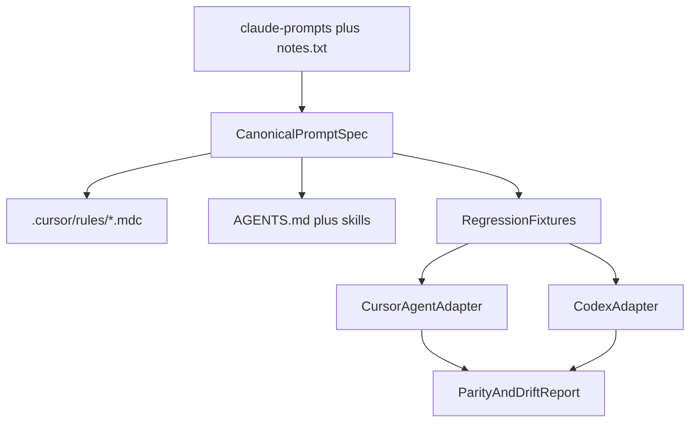

# Build A Dual-Target Philosopher Prompt System

## Goal

Create a prompt system that remains recognizable as your philosopher-based design, is operational rather than purely philosophical, can be transformed into both Cursor and Codex-native formats, and is regression-testable across both targets.

## Desired End State

- One canonical prompt source in this repo that captures:
  - the global operating system
  - the router
  - each philosopher/expert
  - execution-binding rules
  - required output contracts
  - regression expectations
- A generated Cursor bundle under [/.cursor/rules](.cursor/rules).
- A generated Codex bundle rooted in [AGENTS.md](AGENTS.md) plus [skills](skills).
- A shared regression harness that can execute the same logical cases against Cursor GPT and Codex GPT adapters.
- A parity report that shows where the two targets agree, drift, or fail differently.

## Canonical Source Strategy

- Treat the files in [claude-prompts](claude-prompts) as the semantic source material, not the final runtime format.
- Treat [notes.txt](notes.txt) as the migration and testing specification, especially for:
  - execution-binding additions
  - one-primary-expert enforcement
  - output contract expectations
  - router and expert regression cases
- Introduce a canonical intermediate layer in the repo that separates:
  - philosopher intent
  - routing logic
  - runtime constraints
  - output schemas
  - target-specific rendering rules
- Keep this layer small and explicit so future prompt changes are made once and rendered to both Cursor and Codex, instead of manually maintaining two drifting prompt stacks.

## Transformation Pipeline

## Canonical Prompt Spec

- Add a canonical source directory such as [prompt-system](prompt-system) or [prompt-spec](prompt-spec) that stores normalized definitions for:
  - global runtime rules
  - router priorities and tie-breaks
  - expert identity and method
  - required response sections
  - allowed handoffs
  - forbidden blending rules
  - logging and verification constraints
- Normalize each philosopher/expert into explicit fields rather than relying on prose alone, for example:
  - `role`
  - `purpose`
  - `routingSignals`
  - `methodSteps`
  - `requiredSections`
  - `failureSignals`
  - `handoffRules`
- Preserve the original philosophical language where it adds value, but separate it from the operational contract so tests can assert behavior deterministically.

## Cursor Target

- Generate [/.cursor/rules/00-init.mdc](.cursor/rules/00-init.mdc), [/.cursor/rules/01-router.mdc](.cursor/rules/01-router.mdc), and one `.mdc` file per expert from the canonical spec.
- Add Cursor-usable frontmatter and explicit execution-binding instructions so the runtime does all of the following:
  - classify the task
  - choose exactly one primary expert
  - state the routing decision
  - follow the selected method
  - emit the required structure
  - preserve logging and verification rules
- Tighten the router so the selection rule is deterministic when multiple experts could apply, using the principle from `notes.txt`: choose the expert with the highest impact on correctness, not completeness.
- Keep the non-destructive logging contract from [claude-prompts/00-init.md](claude-prompts/00-init.md), but rewrite examples where they conflict with the repo’s actual tooling or shell constraints.

## Codex Target

- Generate [AGENTS.md](AGENTS.md) as the Codex root runtime and [skills](skills) entries for the philosopher/expert workflows.
- Flatten Cursor-specific activation mechanics into Codex-friendly durable instructions:
  - root runtime in `AGENTS.md`
  - expert workflows in `skills/*/SKILL.md`
  - any repeated evaluation or translation workflows as separate reusable skills if needed
- Ensure the Codex target preserves the same behavioral contracts as Cursor:
  - same routing intent
  - same expert isolation rules
  - same required sections
  - same logging and verification constraints
- Document any unavoidable target differences explicitly so parity failures can distinguish expected divergence from regressions.

## Regression Fixtures

- Convert the `Persona Regression Suite` in [notes.txt](notes.txt) into machine-readable fixtures grouped by:
  - router cases
  - expert behavior cases
  - conflict cases
  - drift cases
  - parity cases
- Each fixture should include:
  - prompt text
  - target scope: Cursor, Codex, or both
  - expected primary expert
  - expected sections
  - forbidden behaviors
  - optional allowed handoffs
  - scoring rubric
  - notes on what counts as acceptable variation
- Add a small set of translation/parity fixtures that specifically verify the same canonical expert behaves similarly after rendering to both targets.

## Regression Harness

- Add a minimal Node project at the repo root with [package.json](package.json) and a runner under [scripts](scripts) or [regression](regression).
- Implement a shared harness with:
  - fixture loading
  - prompt wrapping
  - target adapters
  - assertions
  - scoring
  - report generation
- Implement the first adapter around the real Cursor CLI using `agent --print`, readonly mode, and structured output capture.
- Design the adapter interface so a Codex execution path can plug into the same scorer without rewriting the suite.
- Emit raw requests, responses, scores, and summaries to [/.logs](.logs) for every run.

## Scoring And Parity

- Score each run using deterministic checks derived from [notes.txt](notes.txt):
  - selected expert
  - structure compliance
  - verification quality
  - confidence labeling
  - notable drift
- Keep the 0/1/2 rubric from `notes.txt`, but enrich the report with:
  - target name
  - model name
  - prompt wrapper version
  - canonical spec version
  - pass/fail reason
  - parity delta versus the other target
- Add a parity mode that runs the same case against both adapters and highlights:
  - expert mismatch
  - section mismatch
  - missing confidence markers
  - forbidden persona blending
  - acceptable variance versus true regression

## Documentation

- Add operator docs that explain:
  - where the canonical source lives
  - how to regenerate Cursor and Codex outputs
  - how to run smoke and full regression suites
  - how to inspect `.logs`
  - how to add a new philosopher/expert or new test case
  - how to interpret target-specific parity drift
- Add a brief migration map showing how each file in [claude-prompts](claude-prompts) maps into the canonical source, Cursor artifacts, and Codex artifacts.

## Verification

- Verify the transformation path in stages:
  1. Canonical source renders valid Cursor artifacts.
  2. Canonical source renders valid Codex artifacts.
  3. Cursor smoke cases pass through the `agent` CLI.
  4. Codex smoke cases pass through the Codex adapter.
  5. Shared parity cases identify expected equivalence and intentional differences.
- Run a small smoke subset first, then the full suite.
- After the first full run, capture recurring failures as reusable patterns so the system can evolve without losing the original philosopher-based intent.
