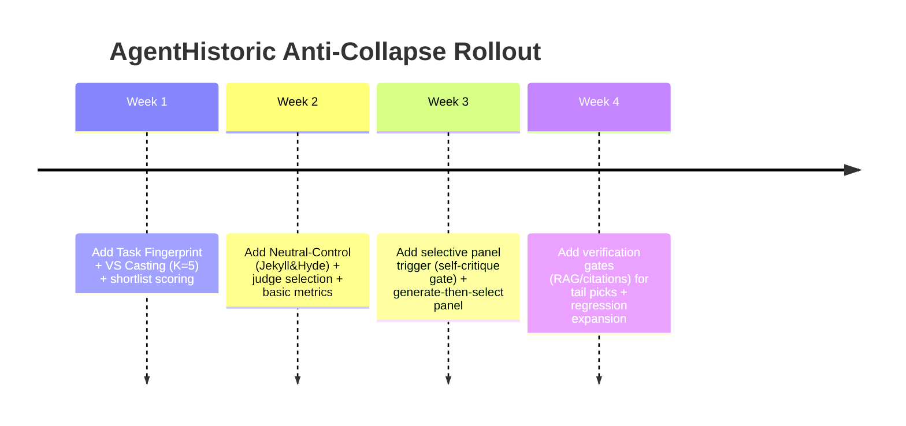

# Mitigating Expert Collapse in LLM Persona Generation (2023–2026 Literature Review for AgentHistoric)

## Executive Summary
Recent research suggests that “expert/persona collapse” (repeatedly selecting mainstream names) is not best solved by adding more persona text, but by adding **test-time structure**: (a) **explicitly sampling the long tail** of the model’s internal distribution (e.g., Verbalized Sampling), (b) **routing and gating** when persona/debate is actually beneficial (e.g., iMAD-style selective debate; PRISM-style intent-based persona routing), and (c) using **multi-agent diversity + judge-based selection** rather than free-form synthesis (evidence from multi-agent debate studies and “selection bottleneck” analyses). In parallel, audits of LLM scholar/expert recommendation show that interventions like **temperature increases and representation-constrained prompting** typically **shift trade-offs** (diversity ↑ but factuality ↓), implying AgentHistoric should pair long-tail expert generation with **verification/judging** and **neutral baselines** to prevent hallucinated niche experts and avoid persona-induced accuracy regressions. citeturn15view0turn22view0turn30view0turn29view0turn28view0turn4search3

## Source Table

| Paper Title | Year | Core Technique | 1-sentence summary of findings |
|---|---:|---|---|
| **AgentHistoric Global Runtime Spec (prompt-system/system.json)** citeturn21view0 | 2026 (repo) | Persona routing policy | AgentHistoric enforces **“select exactly one primary expert”** unless a router-approved pipeline handoff is required, which can amplify whichever expert wins the router prior. citeturn21view0 |
| **AgentHistoric Router Spec (compiled/cursor/rules/01-router.mdc)** citeturn10view0 | 2026 (repo) | Heuristic routing / pipeline control | The router uses **priority-ordered keyword heuristics** and explicitly forbids default persona blending, making early heuristic buckets (e.g., “build/implement/refactor”) disproportionately decisive. citeturn10view0 |
| **AgentHistoric Regression Fixtures (regression/fixtures/cases.json)** citeturn9view1 | 2026 (repo) | Prompt regression testing | The fixture suite encodes “expectedPrimaryExpert” for canonical prompt types (implementation→Peirce, debugging→Popper, etc.), shaping future tuning pressure and revealing where collapse can be “baked in.” citeturn9view1 |
| **Understanding the Effects of RLHF on LLM Generalisation and Diversity** citeturn6search0 | 2023 | Alignment analysis | RLHF can improve generalization but **reduces output diversity**, supporting the idea that alignment contributes to mode/expert collapse. citeturn6search0 |
| **On the Algorithmic Bias of Aligning LLMs with RLHF: Preference Collapse and Matching Regularization** citeturn6search1turn6search5 | 2024–2025 | Alignment theory (preference collapse) | Formalizes “preference collapse” risks in RLHF and proposes matching regularization to better track the preference distribution instead of washing out minority preferences. citeturn6search1 |
| **Detecting Mode Collapse in Language Models via Narration** citeturn6search2turn6search6 | 2024 | Mode-collapse measurement | Shows aligned models can lose the ability to assume diverse “virtual authors,” offering a concrete framing of persona-collapse as an alignment-side effect. citeturn6search2turn6search6 |
| **Verbalized Sampling: How to Mitigate Mode Collapse and Unlock LLM Diversity** citeturn15view0 | 2025 | Long-tail prompting / distribution elicitation | A training-free prompt that forces the model to output a **distribution** (responses + probabilities) and can sample from “tails,” improving diversity (e.g., 1.6–2.1× in creative writing) while maintaining quality/safety in reported experiments. citeturn15view0 |
| **Guiding Large Language Models via Directional Stimulus Prompting** citeturn20view0 | 2023 | DSP (instance-specific stimulus tokens) | Uses a small policy model to generate **directional stimulus** (often keywords) to steer black-box LLMs, reporting substantial improvements in supervised tasks with minimal labeled data. citeturn20view0 |
| **ROSE Doesn’t Do That: Reverse Prompt Contrastive Decoding** citeturn16view0turn27view2turn27view0 | 2024 | Negative constraints via contrastive decoding | Uses a **reverse prompt** to induce undesired behavior and subtracts its logits during decoding; reports up to ~+13.98% safety gains and analyzes multiple reverse-prompt variants. citeturn16view0turn27view2turn27view0 |
| **When “A Helpful Assistant” Is Not Really Helpful: Personas in System Prompts Do Not Improve Performances of LLMs** citeturn2search3turn2search7 | 2023–2024 | Persona evaluation | Across 162 roles and 2,410 factual questions, personas in system prompts do not reliably improve objective performance; selecting the “best” persona per question helps, but **auto-identifying it is hard and often near-random**. citeturn2search3turn2search7 |
| **Principled Personas: Defining and Measuring the Intended Effects of Persona Prompting on Task Performance** citeturn2search2turn2search6 | 2025 | Persona robustness evaluation | Finds expert personas often help slightly or not at all, but irrelevant persona details can cause **large drops (≈30 points)**; proposes mitigations that work best on larger models. citeturn2search2turn2search6 |
| **Persona is a Double-edged Sword (Jekyll & Hyde)** citeturn2search0turn2search16 | 2024–2025 | Neutral+persona ensemble with selection | Role-play can degrade reasoning (reported in 7/12 datasets for one setting), and a **dual-path (persona + neutral) + evaluator selection** improves robustness, including reported average gains (e.g., ~9.98% on GPT‑4 in one report). citeturn2search0turn2search16 |
| **Bias Runs Deep: Implicit Reasoning Biases in Persona-Assigned LLMs** citeturn6search3turn6search11 | 2023–2024 | Persona-induced bias analysis | Demonstrates persona assignment can surface hidden bias and significantly degrade reasoning/accuracy for some personas and datasets, warning against uncontrolled persona injection. citeturn6search3turn6search11 |
| **Expert Personas Improve LLM Alignment but Damage Accuracy: PRISM** citeturn30view0 | 2026 | Intent-based persona routing / gated adaptation | Shows personas can **help alignment-dependent tasks** but **hurt knowledge/reasoning tasks**; proposes PRISM to learn when to activate persona via intent-based routing and lightweight gated adaptation. citeturn30view0 |
| **Encouraging Divergent Thinking in LLMs through Multi-Agent Debate (MAD)** citeturn18view0 | 2024 | Multi-Agent Debate | Introduces MAD to address Degeneration-of-Thought in self-reflection, emphasizing **adaptive stopping** and “tit-for-tat” debate dynamics for performance gains. citeturn18view0 |
| **ChatEval: Better LLM-based Evaluators through Multi-Agent Debate** citeturn11view4turn24search0 | 2024 | Multi-agent debate with diverse roles | Multi-agent debate improves evaluator alignment with human preference (reported +6.2% for ChatGPT and +2.5% for GPT‑4 over single-agent), and highlights that **diverse role prompts** matter. citeturn11view4turn24search0 |
| **iMAD: Intelligent Multi-Agent Debate for Efficient and Accurate LLM Inference** citeturn22view0turn23search0 | 2025–2026 | Selective debate triggering | Selectively triggers debate via a structured self-critique and a lightweight classifier, reporting **up to 92% token reduction** and **up to 13.5% accuracy improvement**, while noting naïve MAD can be 3–5× token cost. citeturn22view0turn23search0 |
| **ConfMAD: Confidence Expression in Multi-Agent Debate** citeturn31view0 | 2025 | Confidence-aware MAD | Finds missing confidence expression can cause incorrect convergence; adding calibrated confidence improves consensus/accuracy and discusses instability/overconfidence risks and mitigations. citeturn31view0 |
| **Demystifying Multi-Agent Debate: The Role of Confidence and Diversity** citeturn26search3turn26search10 | 2026 | Debate theory + diversity-aware initialization | Argues debate needs (i) diverse initial hypotheses and (ii) calibrated confidence use; proposes lightweight interventions that outperform vanilla debate/majority vote on reasoning benchmarks. citeturn26search3turn26search10 |
| **Can LLM Agents Really Debate? A Controlled Study…** citeturn26search2turn26search12 | 2025 | Debate ablation study | Controlled experiments suggest intrinsic reasoning strength and initial diversity dominate debate success; structural tweaks (order, etc.) offer smaller gains. citeturn26search2turn26search12 |
| **When Agents Disagree: The Selection Bottleneck in Multi-Agent LLM Pipelines** citeturn4search3turn4search7 | 2026 | Judge-based selection vs synthesis | Shows strong gains for **generate-then-select** with judges (e.g., reported win-rate 0.810 in a targeted experiment), while synthesis-style aggregation can fail catastrophically. citeturn4search3turn4search7 |
| **Mixture-of-Agents Enhances LLM Capabilities** citeturn4search2turn4search10 | 2024 | Layered multi-agent refinement | Demonstrates layered agent architectures can outperform single models on multiple evals, motivating multi-persona collaboration when properly aggregated. citeturn4search2turn4search10 |
| **RouteLLM: Learning to Route LLMs with Preference Data** citeturn1search2turn19view0 | 2024 | Learned routing to optimize cost/quality | Shows preference-trained routers can preserve quality while reducing cost; LMSYS reports large cost reductions while maintaining ~95% of strong-model performance for some setups. citeturn19view0 |
| **Scalable Prompt Routing via Fine-Grained Latent Task Discovery** citeturn4search0turn4search4 | 2026 | Two-stage routing (latent tasks + quality heads) | Uses automated task discovery plus task-aware quality estimation to beat baselines and exceed the strongest single model at <½ cost in reported benchmarks. citeturn4search0turn4search4 |
| **SELECT-THEN-ROUTE: Taxonomy Guided Routing for LLMs** citeturn25view0 | 2025 | Two-stage routing + confidence cascade | Improves end-to-end accuracy (91.7%→94.3%) while reducing cost by ~4× using decision-space reduction and a multi-judge confidence cascade. citeturn25view0 |
| **Whose Name Comes Up? Auditing LLM-Based Scholar Recommendations** citeturn29view0 | 2025 | Expert recommendation audit | Finds LLMs recommend real scholars but exhibit “rich-get-richer” dynamics and demographic skews (e.g., senior/male/White overrepresentation) plus errors/hallucinations in expert lists. citeturn29view0 |
| **LLMScholarBench: Benchmarking & Intervention-Based Auditing…** citeturn28view0turn28view1 | 2026 | Intervention audit (temperature, constraints, RAG) | Shows interventions shift trade-offs: higher temperature harms validity/factuality; representation constraints improve diversity but reduce factuality; RAG improves technical quality but can reduce diversity/parity. citeturn28view0turn28view1 |
| **AutoGen: Multi-Agent Conversation Framework** citeturn1search3turn24search1turn24search5 | 2023–2026 | Engineering framework for multi-agent systems | Provides an open-source framework for building multi-agent LLM apps with programmable conversation patterns; useful scaffolding for AgentHistoric-style orchestration. citeturn1search3turn24search1turn24search5 |
| **AI Agent Orchestration Patterns (Azure Architecture Center)** citeturn5search0turn24search3 | 2026 | Engineering patterns (concurrent/handoff/group chat) | Catalogs orchestration patterns and emphasizes choosing the minimum complexity pattern required—relevant when deciding when to pay for panels/debate. citeturn5search0turn24search3 |
| **Agentic AI patterns and workflows on AWS (Prescriptive Guidance)** citeturn5search1turn5search7 | 2024–2026 | Engineering workflows / control & observability | Summarizes patterns for orchestration, delegation, and observability that map onto “scatter-gather” and debuggable multi-step agent systems. citeturn5search1turn5search7 |

## Actionable Techniques
- **Long-tail expert casting via Verbalized Sampling (VS) rather than “pick one expert”** (training-free, works on black-box LLMs). Use the VS template to force the model to emit **K candidate experts + probabilities**, then explicitly sample from the **tails** to avoid mainstream collapse:  
  **Template keywords (from VS prompt):** “generate a set of five possible responses… include a numeric `<probability>`… sample at random from the **tails** of the distribution, such that the probability of each response is **less than 0.10**.” citeturn15view0  
  **Implementation notes:** set `K=5–10`, parse probabilities, and sample with a **tail constraint** (e.g., reject any candidate with `p>0.10`); this increases output tokens roughly proportional to K but directly targets “mode collapse” by changing the prompt’s modal behavior. citeturn15view0

- **Neutral-control ensemble (Jekyll & Hyde pattern) to prevent persona prompts from harming accuracy.** Run **two solvers**: one with your selected persona/expert, one **neutral (no persona)**; then use an evaluator to select the best output. This directly matches findings that role-play can degrade reasoning in a notable fraction of datasets, while a dual-path ensemble improves robustness. citeturn2search0turn2search16  
  **Concrete prompt skeleton:**  
  - Persona path system: `You are {EXPERT}. Follow {EXPERT_CONTRACT}.`  
  - Neutral path system: `You are a helpful assistant. Solve the task directly; no role-play.`  
  - Judge prompt: `Given Answer A and Answer B, choose which better satisfies correctness + constraints. Output: {A|B} + 2-sentence justification.`  
  **Decoding/control:** keep temperature low for judge (e.g., 0–0.2) to reduce evaluator variance; run position-swapped judging if you see position bias (PRISM explicitly calls out evaluation bias and uses pairwise comparisons/position swapping as a mitigation). citeturn30view0

- **Selective multi-agent debate gating (iMAD-style) instead of “always debate.”** Before launching a panel/debate, force a **structured self-critique** from a single agent and trigger debate only if uncertainty/hesitation cues are present, mirroring iMAD’s “debate only when beneficial” framing and cost concerns (MAD can be 3–5× token cost; iMAD reports up to 92% token reduction vs always-debate). citeturn22view0turn18view0  
  **Self-critique prompt fields (inspired by iMAD):**  
  - `Initial Answer:`  
  - `Best Alternative Answer:`  
  - `Why the alternative might be correct:`  
  - `Confidence(initial): 0–100`  
  - `Confidence(alternative): 0–100` citeturn22view0  
  **Trigger rule (simple, prompt-only):** if `abs(conf_initial - conf_alt) < 15` OR the critique contains hedges (“might”, “uncertain”, contradictions) → run panel; else stay single. (iMAD uses richer features + a classifier, but this lightweight heuristic captures the same gating goal.) citeturn22view0

- **Anti-mainstream suppression via reverse prompts (ROSE-style) when you have logits; otherwise approximate with rejection sampling + judging.** ROSE defines a contrastive decoding rule that subtracts logits from a **reverse prompt** at each decoding step: `softmax[logit(pos) − α logit(reverse)]`, and provides reverse prompt variants (random words, opposite-replace, manual). citeturn27view2turn27view0  
  **Practical translation for AgentHistoric:**  
  - If you serve an open-weight model with logits access (vLLM/TGI/etc.), implement ROSE-style decoding where the reverse prompt enumerates “mainstream expert choices” and the positive prompt asks for niche experts; tune `α` as the “mainstream penalty knob.” citeturn27view2turn27view0  
  - If you are on a closed API (no logits), approximate by: (1) generate K experts normally, (2) generate K experts under a **reverse prompt that tries to force mainstream names**, (3) penalize or filter any overlaps, then (4) use a judge to select among survivors. (This mirrors ROSE’s “induce undesired output then suppress it,” but at the sequence level.) citeturn16view0turn27view2

- **Two-stage “decision-space reduction” routing for expert/persona selection (Select‑Then‑Route / FineRouter pattern).** Make expert selection a retrieve-then-rank problem: first generate a **high-recall shortlist** of plausible experts (including long-tail), then do a second-stage selection/judging—this mirrors Select‑Then‑Route’s explicit separation of decision-space reduction from final selection and FineRouter’s two-stage architecture. citeturn25view0turn4search0  
  **Concrete keywords/templates:**  
  - Stage 1: “Return 12 candidate experts; prioritize coverage over precision; include at least 6 niche/less-cited candidates.”  
  - Stage 2: “Rank candidates by task-fit; penalize duplicates and ‘celebrity philosophers’; select top 1–3.”  
  **Control:** keep Stage‑1 temperature moderate (0.7–1.0) to widen candidate space, then keep Stage‑2 low (0–0.2) for stable selection, reflecting audit findings that higher temperature can degrade validity/factuality in expert recommendation. citeturn28view0turn28view1

## Limitations
Multi-agent debate and complex prompt chaining have three recurring risks in the 2023–2026 literature: **cost blow-ups**, **collapse/loop failure modes**, and **judge/selector bias**. First, naïvely applying debate everywhere is expensive and can even degrade accuracy; iMAD notes MAD’s iterative queries drive high token usage and can overturn correct single-agent answers, motivating selective triggering (reporting up to 92% token savings and up to 13.5% accuracy gains when debate is gated). citeturn22view0turn23search0 Second, debate can collapse to majority pressure or premature convergence: ConfMAD reports that without good confidence signaling, even when one agent is initially correct, fewer than half of such debates may converge to the correct answer in some settings, and warns that poor confidence expression can cause stubbornness or premature convergence. citeturn31view0 Controlled debate studies similarly emphasize that initial diversity and intrinsic reasoning strength are dominant drivers; mere structural tweaks (order/depth) can be limited. citeturn26search2turn26search12 Third, aggregation matters more than “more agents”: selection-bottleneck work shows judge-based **selection** can massively outperform synthesis-style aggregation (and synthesis can fail across many tasks), meaning AgentHistoric should bias toward **independent drafts + judge** rather than blended “committee-written” outputs. citeturn4search3turn4search7

Bias and hallucination risks become sharper when you explicitly push into low-probability niches. Scholar recommendation audits show that “diversity interventions” frequently trade off against factuality: representation-constrained prompting improves diversity but reduces factuality; higher temperature degrades validity/consistency; even RAG can improve technical quality while reducing diversity/parity. citeturn28view0turn28view1turn29view0 This implies AgentHistoric’s anti-mainstream penalties (negative prompts, tail sampling) should be paired with **verification gates** (e.g., minimal evidence requirement, citations, RAG cross-checks) and/or a neutral-control baseline (Jekyll & Hyde) to avoid “creative but fake” experts. citeturn2search0turn2search16turn30view0

### Better outcome implementation plan for AgentHistoric
This plan synthesizes the strongest ideas from: (1) **distribution elicitation** (Verbalized Sampling), (2) **selective test-time scaling** (iMAD, Select‑Then‑Route), (3) **persona safety rails** (Jekyll & Hyde, PRISM, Principled Personas), and (4) your system’s current constraint that you normally select **one primary expert** and avoid blending unless an explicit pipeline is invoked. citeturn21view0turn10view0turn15view0turn22view0turn25view0turn30view0turn2search2

#### Architecture diagram (Mermaid)
```mermaid
flowchart TD
  U[User Task] --> T[Task Fingerprint Extractor<br/>neutral, structured schema]
  T --> M{Mode Decision<br/>single vs panel?}
  M -->|single| C[Long-tail Casting Director<br/>Verbalized Sampling over experts]
  M -->|panel| C

  C --> S[Shortlist Scorer<br/>anti-mainstream penalties + task-fit]
  S --> R{Route Type}
  R -->|neutral baseline| N[Neutral Solver]
  R -->|persona expert| P[Persona Solver<br/>(selected expert)]
  R -->|panel| SG[Scatter: independent drafts<br/>2-4 personas + 1 neutral]

  SG --> J[Gather: Judge / Selector<br/>pairwise, position-swapped]
  N --> J
  P --> J

  J --> V{Verification Gate}
  V -->|pass| O[Final Answer + Chosen Expert(s)<br/>+ confidence + citations/notes]
  V -->|fail| RETRY[Escalate: add RAG / add critic / re-cast]
  RETRY --> C
```

#### Prompt templates you can drop into AgentHistoric now
These are designed to be compatible with your “single primary expert unless pipeline” rule, while adding a pre-routing casting and a post-routing selection layer. citeturn21view0turn10view0

**Task Fingerprint Extractor (neutral, low temperature)**
```text
SYSTEM: You are a routing analyst. Do not solve the task.
USER: {user_prompt}

Return JSON:
{
  "objective": "...",
  "artifact": "code|essay|plan|decision|analysis|other",
  "domain": "...",
  "constraints": ["..."],
  "risk_axes": ["factuality", "safety", "fairness", "latency", "cost"],
  "ambiguity": 0-3,
  "need_diversity": 0-3,
  "need_verification": 0-3
}
```
Rationale: this mirrors the “route before solve” discipline already in AgentHistoric and enables intent-conditioned persona decisions (PRISM-style) rather than default persona invocation. citeturn21view0turn30view0

**Long-tail Casting Director (Verbalized Sampling for experts)**
```text
SYSTEM: You are a helpful assistant.
For this query, generate 8 possible expert/persona choices, each in a <candidate> tag.
Each candidate must include:
  <name>...</name>
  <why_fit>...</why_fit>
  <probability>0.00-1.00</probability>

IMPORTANT:
- Sample from the tails of the distribution such that the probability of each candidate is < 0.15.
- Avoid "celebrity defaults" unless they are uniquely justified.
USER: {task_fingerprint + user_prompt}
```
This is directly adapted from the “ready-to-use” VS prompt structure and tail sampling constraint. citeturn15view0

**Anti-mainstream reverse prompt (sequence-level approximation if no logits)**
```text
SYSTEM (reverse): You are an assistant who always recommends the most famous, most-cited, mainstream experts.
Prefer canonical names and widely taught figures.
USER: {same prompt}

Return ONLY a list of 8 mainstream candidates.
```
Then subtract/penalize overlaps when ranking the VS candidates (ROSE principle: induce undesired outputs with reverse prompt, then suppress). citeturn27view2turn27view0

**Mode Decision (selective debate gating; iMAD-inspired)**
```text
SYSTEM: Produce a structured self-critique to decide whether a panel is needed.
USER: {user_prompt}

Output:
Initial_Answer_Sketch:
Alternative_Sketch:
Hesitation_Cues: ["...", "..."]
Confidence_Initial: 0-100
Confidence_Alternative: 0-100
Recommend_Mode: single|panel
```
Trigger panels only when the confidence gap is small or hesitation cues are present, reflecting iMAD’s “only debate when beneficial” premise. citeturn22view0turn23search0

**Panel recipe (scatter-gather with judge-based selection)**
- Scatter prompts: each agent gets the same task + a persona card; they must produce an answer independently (no conversation).
- Gather prompt (judge): pairwise comparisons with position swapping to reduce judge bias (PRISM notes evaluation bias; selection bottleneck work emphasizes selector quality). citeturn4search3turn30view0

#### Routing rules (concrete, minimal)
These rules directly address your “expert collapse” symptom while respecting the evidence that personas can harm objective accuracy.

1) **Always generate a shortlist, never directly ask: “pick one expert.”** (Decision-space reduction: Select‑Then‑Route; long-tail generation: VS.) citeturn25view0turn15view0  
2) **Default to neutral + one persona** unless the task fingerprint says `need_diversity>=2` or the self-critique says `Recommend_Mode=panel`. (iMAD + Jekyll&Hyde.) citeturn22view0turn2search0turn2search16  
3) **Debate/panel aggregation must be “select,” not “synthesize.”** Use judge choice; do not blend prose. citeturn4search3turn4search7  
4) **Any “diversity forcing” increases verification requirements.** If you are sampling from tails or applying representation constraints, require at least one of: citations, RAG lookup, or database verification (LLMScholarBench shows diversity interventions trade off with factuality). citeturn28view0turn28view1turn29view0  
5) **Minimize irrelevant persona detail in the router path.** Keep persona “voice” separate from routing metadata, because irrelevant persona attributes can materially harm performance. citeturn2search2turn2search6turn30view0

#### Comparison table (token/cost vs gains, as reported)
These are best-effort comparisons using reported results where available; where papers don’t publish token counts, the table uses the mechanism’s structural cost.

| Method | Extra inference cost (typical) | Reported quantitative upside | Key requirement / constraint |
|---|---|---|---|
| MAD | Often multi-round, multi-agent; iMAD cites many MAD systems are **3–5× tokens** vs single-agent | Improves reasoning on hard tasks; needs adaptive stopping and “tit-for-tat” moderation to avoid degeneration | Needs careful stopping + judge design; beware unfair judges when mixing different backbones citeturn22view0turn18view0 |
| iMAD | Adds a structured self-critique + triggers debate only sometimes | **Up to 92% token reduction** vs always-debate and **up to 13.5% accuracy improvement** on evaluated datasets | Requires gating signal (classifier in paper; can approximate with heuristics) citeturn22view0turn23search0 |
| ChatEval | Multi-agent debate with roles over evaluation; at least multiple agent turns (paper discusses 2 agents / 2 turns in an ablation) | Improves evaluator accuracy alignment: **+6.2% (ChatGPT), +2.5% (GPT‑4)** over single-agent evaluation | Diverse role prompts matter; otherwise gains disappear citeturn11view4turn24search0 |
| Verbalized Sampling | Output expands by **K responses** (e.g., 5–8 candidates + probabilities) | Diversity gains (e.g., **1.6–2.1×** creative-writing diversity; also improves diversity-quality trade-offs) | Requires parsing probabilities; instruct “tails” / `p<…` to avoid mainstream mode citeturn15view0 |
| ROSE | Requires logits from **two prompts per decoding step** (positive + reverse); compute roughly increases accordingly | Up to **~+13.98% safety score** in reported tasks (safety-focused, but general method is “suppress undesired concepts”) | Needs logit access; reverse prompt must strongly induce the “bad” behavior for best effect citeturn16view0turn27view2turn27view0 |

#### Evaluation metrics (make “expert collapse” measurable)
Borrowing directly from scholar-recommendation auditing, you want **both technical quality and social/coverage metrics** so improvements aren’t fake.

| Metric family | What to measure in AgentHistoric | Why it matters |
|---|---|---|
| Validity / factuality | Is the chosen expert real (if human) or internally consistent (if persona archetype)? Are claims grounded? | Diversity forcing can increase hallucinated “experts.” citeturn28view0turn29view0 |
| Diversity / coverage | Unique experts per 100 tasks; entropy / Simpson index over expert IDs; “tail hit-rate” | Directly detects expert collapse and long-tail access. citeturn15view0turn28view0 |
| Consistency | Stability of expert selection across reruns (temp=0 and temp>0) | Scholar audits show variability and duplication; you want predictable routing. citeturn29view0turn28view0 |
| Utility / win-rate | Pairwise preference wins of final outputs vs baseline (Chatbot Arena-style) | Prevents optimizing “diversity theater” that harms usefulness. citeturn5search5turn5search12 |
| Cost | Tokens/calls per query by mode (single vs panel) | Selective scaling is the practical lever; StR/iMAD show large cost savings from gating. citeturn25view0turn22view0 |

#### Rollout checklist (short, concrete)
- Implement **Task Fingerprint → Mode Decision → Casting Director → Shortlist Scorer → (Neutral + Persona) → Judge Select** as an explicit pipeline (no hidden blending). citeturn10view0turn4search3  
- Add a regression suite slice specifically for **expert collapse**: prompts where the “correct” expert is niche, and the mainstream pick is penalized unless uniquely justified (mirrors LLMScholarBench’s intervention-aware auditing philosophy). citeturn28view0turn28view1  
- Start with **K=5** VS candidates and **2-path Jekyll&Hyde**; only then add panels, gated by self-critique. citeturn15view0turn2search0turn22view0  
- Ensure panels use **generate-then-select**, not synthesis, and add position-swapped judging if bias appears. citeturn4search3turn30view0  
- Track a live dashboard of **diversity vs factuality vs cost** (expect trade-offs; don’t assume monotonic improvement). citeturn28view0turn28view1



The critical synthesis is: **don’t fight collapse only in the prompt**. Treat expert selection as a **two-stage routing + selection problem** (Select‑Then‑Route / FineRouter), generate candidates from the **tail** (Verbalized Sampling), and safeguard correctness with **neutral baselines and judge-based selection** (Jekyll & Hyde; selection bottleneck evidence). This architecture directly addresses why your current “single primary expert + priority keyword routing” can repeatedly rediscover the same mainstream expert: the system is optimized to decide early, not to explore. citeturn10view0turn21view0turn15view0turn25view0turn4search3turn2search2